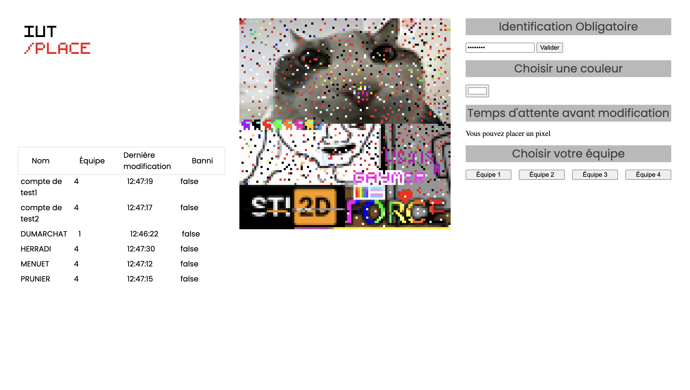

# Pixel War IUT

Ce projet mets en compétition les étudiants de l'IUT de Bordeaux dans une conquête de territoire sur une toile publique.

Le projet fait une synthèse de toutes les notions de base de JavaScript et du web Vanilla au sens large : DOM, requêtes asynchrones, déstructuration.

## Structure

Le projet est organisé en plusieurs répertoires et fichiers distincts :

Trois répertoires d'organisation :

- Style, répertoire de stockage de feuilles de style
- Script, répertoire de stockage de fichiers JavaScript contenant la logique métier de l'application
- Assets, répertoire de stockage de fichiers annexes (images statiques)

Le répertoire `script` contient 3 fichiers :

- grid-view.js : Logique pour le DOM
- api.js : Logique pour les requêtes asynchrones
- env.json : Conteneur de l'UID pour la phase de développement

## Améliorations

En addition à l'énoncé de base j'ai ajouté un système de pop-up s'activant à chaque retour du serveur. J'ai également ajouté le stockage dans le Local Storage de l'identifiant du joueur afin d'éviter de remplir ce champ à chaque rafraîchissement de la page.
